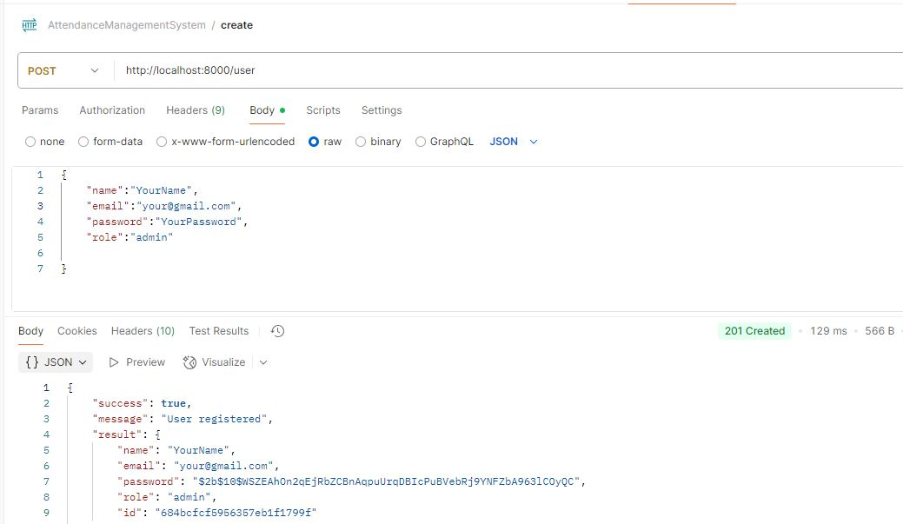

# MERN Attendance Management System

A fullstack MERN (MongoDB, Express, React, Node.js) Attendance Management System.

---

## 📁 Project Structure

- `Attendance_backend/` – Backend API built with Node.js, Express, and MongoDB
- `Attendance_forntend/vite-project/` – Frontend built with React and Vite

---

## 🚀 Getting Started

### Prerequisites

- [Node.js](https://nodejs.org/) (v18 or later recommended)
- MongoDB running locally or a MongoDB Atlas URI

---

### Backend Setup

1. Navigate to backend folder:

   ```bash
   cd Attendance_backend

2. Install dependenciesr:

   ```bash
   npm install
   
3. Configure constants:
   Open config/constant.js and set port, dburl and secretKey :
   ```bash
   export const port = 8000;
   export const dburl = "mongodb://0.0.0.0:27017/dw22"; // create a data base and put its url here dw22 is my database
   export const secretkey = "hidethis"; // can be any or specific if needed

4. Run the backend server:

   ```bash
   npm run dev


### Forntend Setup

1. Navigate to backend folder:

   ```bash
   cd Attendance_forntend/vite-project

2. Install dependenciesr:

   ```bash
   npm install

3. Configure backend URL:
   Open .env :
   ```bash
  VITE_URL = http://localhost:8000  /your backend url


  Note: 

